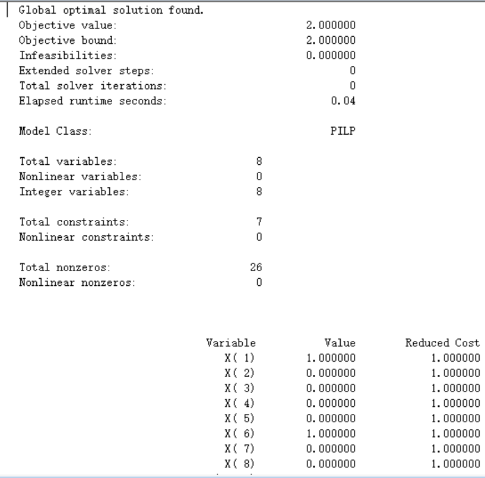

# 教材4.7 救护站设置问题
## 1.问题：

某市由8个行政区组成,各区之间的救护车辆的行车时间(单位:min)如表4-14所
示.市政府拟在市区内建立公共救护中心,设计要求从各区到救护中心的行车时间都不超过10min.该市政府请你提供可行的设计方案:全市至少要建几个救护中心,具体建在哪个区?

## 2.建立数学模型：
根据题意，设：
 $$
 x_i = 
 \begin{cases}
 1,\,\,在i区建立救护中心\\
 0,\,\,在i区不建立救护中心\\
 \end{cases}
 $$
由分析可得，假如在1建立，那么1，2，7区可用。
则可得以下矩阵：
 $$
 A =(a_{ij})_{8\times8} = 
\begin{pmatrix}
1 & 1 & 0 & 0 & 0 & 0 & 1 & 0 \\
1 & 1 & 0 & 0 & 0 & 0 & 0 & 0 \\
0 & 0 & 1 & 1 & 1 & 1 & 0 & 0 \\
0 & 0 & 1 & 1 & 1 & 1 & 0 & 0 \\
0 & 0 & 1 & 1 & 1 & 1 & 0 & 0 \\
0 & 0 & 1 & 1 & 1 & 1 & 0 & 1 \\
1 & 0 & 0 & 0 & 0 & 0 & 1 & 0 \\
0 & 0 & 0 & 0 & 0 & 1 & 0 & 1 \\
\end{pmatrix}
 $$

由此，我们可得整数规划模型。

$$
\min z =\sum_{n=1}^8 x_i
\\
 \begin{cases}
 \sum_{j=1}^8 a_{ij}x_j\geqslant1,\,\,i=1,2,...,8\\
 x_j=0或x_j=1\\
 \end{cases}
$$
## 3.代码：
```python
MODEL:
sets:
num_i/1..8/;
num_j/1..8/: x ;
link(num_i , num_j ) : a ;
endsets
data:
x = 1,1,1,1,1,1,1,1;
a = 1,1,0,0,0,0,1,0,
    1,1,0,0,0,0,0,0,
    0,0,1,1,1,1,0,0,
    0,0,1,1,1,1,0,0,
    0,0,1,1,1,1,0,0,
    0,0,1,1,1,1,0,1,
    1,0,0,0,0,0,1,0,
    0,0,0,0,0,1,0,1;
enddata
[OBJ] max = @sum(num_j(j) : x(j));
      x(1) + x(2) + x(7) >=1;
      x(3) + x(4) + x(5) +(6) >=1;
      x(3) + x(4) + x(5) +(6) +x(8)>=1;
      X(6) + x(8) >=1;
      @for(num_j(j) : @BIN(x(j)));
END
```
## 4.求解结果

**由此可得：**
**我们至少建立2个救护中心,具体建在1和6区**