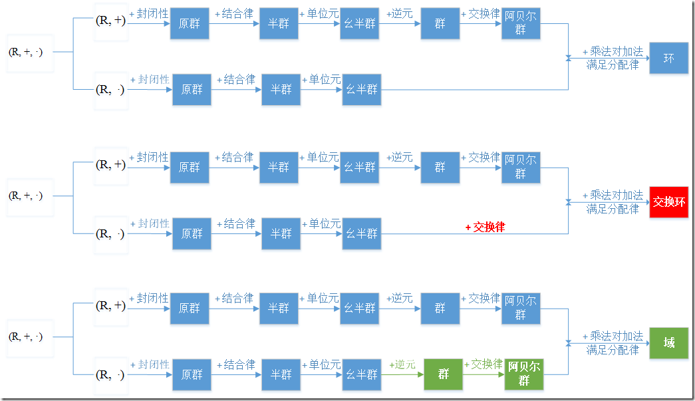

### 求模的逆元:
>用类似辗转相除法，求二元一次不定方程 47x+30y=1  47x+30y=1的整数解。  
47 = 30 * 1 + 17  
30 = 17 * 1 + 13  
17 = 13 * 1 + 4  
13 = 4 * 3 + 1  
然后把它们改写成“余数等于”的形式  
17 = 47 * 1 + 30 * (-1) //式1  
13 = 30 * 1 + 17 * (-1) //式2  
4 = 17 * 1 + 13 * (-1) //式3  
1 = 13 * 1 + 4 * (-3)  
然后把它们“倒回去”  
1 = 13 * 1 + 4 * (-3)  
1 = 13 * 1 + [17 * 1 + 13 * (-1)] * (-3) //应用式3  
1 = 17 * (-3) + 13 * 4  
1 = 17 * (-3) + [30 * 1 + 17 * (-1)] * 4 //应用式2  
1 = 30 * 4 + 17 * (-7)  
1 = 30 * 4 + [47 * 1 + 30 * (-1)] * (-7) //应用式1  
1 = 47 * (-7) + 30 * 11  
得解x=-7, y=11。  
47的逆元为-7  

## 扩展欧几里得算法 ax + by = gcd(a, b)：
```c++
int exGcd(int a, int b, int &x, int &y){
	if(b == 0){
		x = 1;
		y = 0;
		return a;
	}
	int g = exGcd(b, a % b, x, y);
	int temp = x;
	x = y;
	y = temp - a / b * y;
	return g;
}
```

### c++中补充：  
>在C++中，int &是引用类型的变量，它可以用来创建一个指向已存在的int变量的引用。引用是一个别名，它允许我们使用不同的名称来访问同一个变量。使用int &可以实现对变量的直接访问和修改，而不需要通过指针来间接操作。**注意，这里的&是引用，不是地址**  

>int &的作用主要包括以下几个方面：  
1.别名：int &可以用来创建一个变量的别名，使得我们可以使用不同的名称来访问同一个变量，从而提高代码的可读性和可维护性。  
2.函数参数传递：通过使用int &作为函数参数，可以实现对变量的直接修改，而不需要通过返回值来传递修改后的值。这样可以提高函数的效率和灵活性。  
3.函数返回值：可以将int &作为函数的返回类型，使得函数返回的是一个已存在的int变量的引用，而不是一个新的副本。这样可以避免不必要的内存拷贝，提高程序的性能。  
>>需要注意的是，int &必须引用一个已存在的int变量，而不能引用一个常量或临时变量。另外，一旦int &被初始化后，它将一直引用同一个变量，不能再引用其他变量。


  
