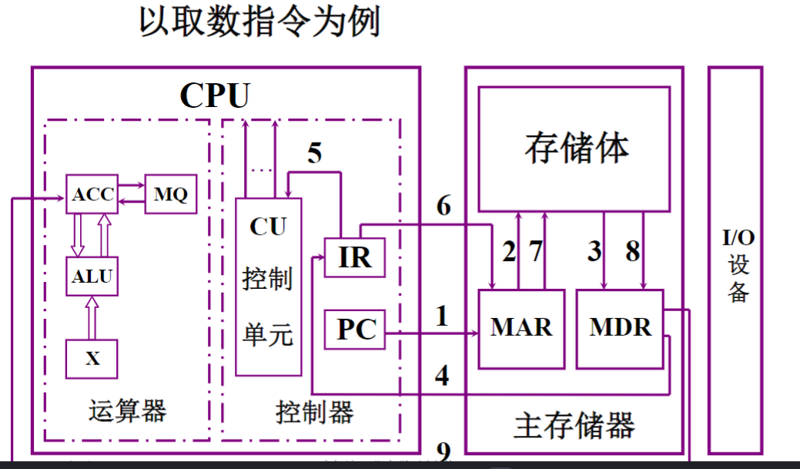

## 常见
> CPU、PC、IR、CU、ALU、ACC、MQ、X、MAR、MDR、I/O、MIPS、CPI、FLOPS  
　　**全面的回答应分英文全称、中文名、中文解释三部分。**  
　　CPU——Central Processing Unit，中央处理机(器)  
　　PC——Program Counter，程序计数器，存放当前欲执行指令的地址，并可自动计数形成下一条指令地址的计数器;  
　　IR——Instruction Register，指令寄存器，存放当前正在执行的指令的寄存器;  
　　CU——Control Unit，控制单元(部件)，控制器中产生微操作命令序列的部件，为控制器的核心部件;  
　　ALU——Arithmetic Logic Unit，算术逻辑运算单元，运算器中完成算术逻辑运算的逻辑部件;  
　　ACC——Accumulator，累加器，运算器中运算前存放操作数、运算后存放运算结果的寄存器;  
　　MQ——Multiplier-Quotient Register，乘商寄存器，乘法运算时存放乘数、除法时存放商的寄存器。  
　　X——此字母没有专指的缩写含义，可以用作任一部件名，在此表示操作数寄存器，即运算器中工作寄存器之一，用来存放操作数;  
　　MAR——Memory Address Register，存储器地址寄存器，内存中用来存放欲访问存储单元地址的寄存器;  
　　MDR——Memory Data Register，存储器数据缓冲寄存器，主存中用来存放从某单元读出、或写入某存储单元数据的寄存器;  
　　I/O——Input/Output equipment，输入/输出设备，为输入设备和输出设备的总称，用于计算机内部和外界信息的转换与传送;  
　　MIPS——Million Instruction Per Second，每秒执行百万条指令数，为计算机运算速度指标的一种计量单位;  

*计算例子的程序清单*  
  
  
>控制部件通过控制线向执行部件发出各种控制命令，通常这种控制命令叫做微命令，是最小单位，组成微指令 。  
在机器的一个CPU周期中，一组实现一定操作功能的微命令的组合，构成一条微指令。  
事实上一条机器指令的功能是由许多条微指令组成的序列来实现的。这个微指令序列通常叫做微程序.
>* 微操作：指令执行时必须完成的基本操作。例如，PC→AR，PC+1→ PC，RAM→IR。

#### 错误  
    1. 计算机中，控制单元负责指令译码；

>   其他
    1. 总线宽度  
    总线的宽度：指总线在单位时间内可以传输的数据总数（即平常说的32位，64位 ）  
    总线宽度=总线位宽=数据线的根数  
    2. 总线带宽  
    总线带宽：指总线在单位时间内可以传输的数据总数（等于总线的宽度与工作频率的乘积）
    通常单位：MB/s(MBps)
    总线的传输速率=总线的带宽=（总线位宽/8位）*（总线工作频率/总线周期时钟数）
>
    假设总线的时钟频率为100MHz，总线的传输周期为4个总线周期，总线的宽度为32位，试求总线的数据传输率

    解：根据总线的时钟频率为100HMz，得：
    1个时钟周期为：1/100MHz=0,01μs
    1个总线传输周期为：0.01μs4=0.04μs
    总线宽度为32位：32bits/8=4B（字节）
    总线的传输率=总线的带宽=4B*（1/0.04μs）=100MB/s

>    主频和时钟周期
    1.主频：指CPU内核工作的时钟频率。
    2.时钟周期：CPU内部两个功能部件之间传递信息所需要的最短时间。
    3.主频和时钟周期互为倒数：
    例如：主频100MHz，则时钟周期为10ns。
