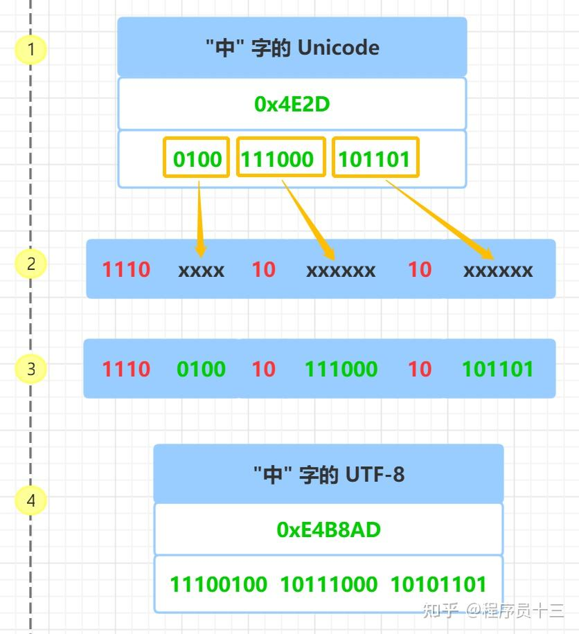
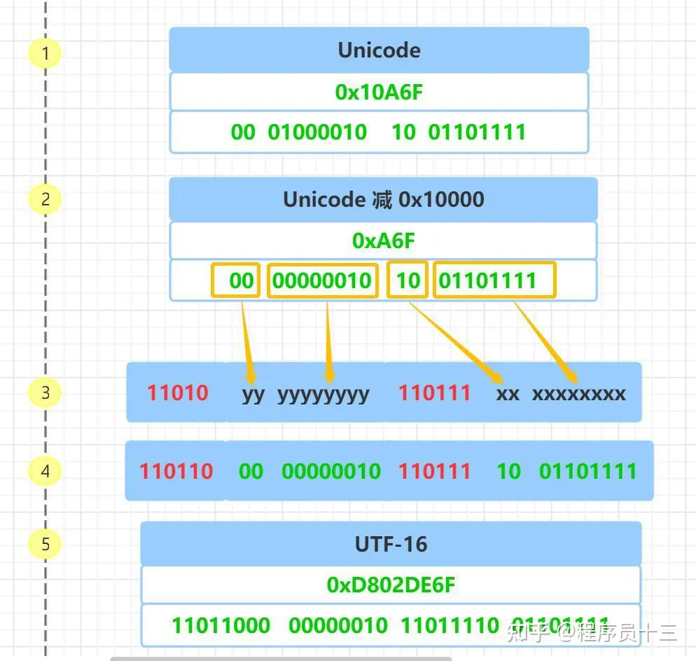

### 字符集与字符编码：  
1. 字符集是很多个字符的集合，例如 GB2312 是简体中文的字符集，它收录了六千多个常用的简体汉字及一些符号，数字，拼音等字符  

2. 字符编码是 字符集的一种实现方式，把字符集中的字符映射为特定的字节或字节序列，它是一种规则

3. 比如：Unicode 只是字符集，UTF-8、UTF-16、UTF-32 才是真正的字符编码规则

>UTF-8、UTF-16、UTF-32 中的 "UTF" 是 "Unicode Transformation Format" 的缩写，意思是"Unicode 转换格式"，后面的数 字表明至少使用多少个比特位来存储字符, 比如：UTF-8 最少需要8个比特位也就是一个字节来存储，对应的， UTF-16 和 UTF-32 分别需要最少 2 个字节 和 4 个字节来存储  

### UTF-8编码规则：
>   1. 对于单字节的符号，字节的第一位设为 0，后面 7 位为这个符号的 Unicode 码。因此对于英语字母，UTF-8 编码和 ASCII 码是相同的, 所以 UTF-8 能兼容 ASCII 编码，这也是互联网普遍采用 UTF-8 的原因之一  
>2. 对于 n 字节的符号（ n > 1），第一个字节的前 n 位都设为 1，第 n + 1 位设为 0，后面字节的前两位一律设为 10 。剩下的没有提及的二进制位，全部为这个符号的 Unicode 码  


#### UTF-16:
> 1. 对于 Unicode 码小于 0x10000 的字符， 使用 2 个字节存储，并且是直接存储 Unicode 码，不用进行编码转换  
>2. 对于 Unicode 码在 0x10000 和 0x10FFFF 之间的字符，使用 4 个字节存储，这 4 个字节分成前后两部分，每个部分各两个字节，其中，前面两个字节的前 6 位二进制固定为 110110，后面两个字节的前 6 位二进制固定为 110111, 前后部分各剩余 10 位二进制表示符号的 Unicode 码 减去 0x10000 的结果  
>3. 大于 0x10FFFF 的 Unicode 码无法用 UTF-16 编码
  

### String:
>1、反斜杠可以用来转义，使用r可以让反斜杠不发生转义。  
2、字符串可以用+运算符连接在一起，用*运算符重复。  
3、Python中的字符串有两种索引方式，从左往右以0开始，从右往左以-1开始。  
4、Python中的字符串不能改变。
>>注：3中的-1是倒数第二个。但在List中，是最后一个。  

**Python是一种解释型脚本语言，在执行之前不同要将所有代码先编译成中间代码，Python程序运行时是从模块顶行开始，逐行进行翻译执行，所以，最顶层（没有被缩进）的代码都会被执行，所以Python中并不需要一个统一的main()作为程序的入口。在某种意义上讲，“if __ name__==’__ main__:”也像是一个标志，象征着Java等语言中的程序主入口，告诉其他程序员，代码入口在此——这是“if __name __==’__main __:”这条代码的意义之一。**

### __ name __  
> 1. Python解释器在导入模块时，会将模块中没有缩进的代码全部执行一遍（模块就是一个独立的Python文件）。开发人员通常会在模块下方增加一些测试代码，为了避免这些测试代码在模块被导入后执行，可以利用__name__属性。  
>2. __ name _ _ 属性是Python的一个内置属性，记录了一个字符串。
若是在当前文件，_ _ name__ 是__main __ 。
在hello文件中打印本文件的__name __ 属性值，显示的是 __ main__  

## 推导式：
**1. List**
```python
[表达式 for 变量 in 列表] 
[out_exp_res for out_exp in input_list]

或者 

[表达式 for 变量 in 列表 if 条件]
[out_exp_res for out_exp in input_list if condition]
```
> names = ['Bob','Tom','alice','Jerry','Wendy','Smith']  
> new_names = [name.upper()for name in names if len(name)>3]  
> print(new_names)  
结果： ['ALICE', 'JERRY', 'WENDY', 'SMITH']  

2.**dirt**  
>{ key_expr: value_expr for value in collection }  
或  
{ key_expr: value_expr for value in collection if condition }  
```python
listdemo = ['Google','Runoob', 'Taobao']
# 将列表中各字符串值为键，各字符串的长度为值，组成键值对
>>> newdict = {key:len(key) for key in listdemo}
>>> newdict
{'Google': 6, 'Runoob': 6, 'Taobao': 6}
```

3.**set**  
>{ expression for item in Sequence }  
或  
{ expression for item in Sequence if conditional }
  
## 迭代器：
>迭代器是一个可以记住遍历的位置的对象。  
迭代器对象从集合的第一个元素开始访问，直到所有的元素被访问完结束。迭代器只能往前不会后退。  
迭代器有两个基本的方法：iter() 和 next()。  
字符串，列表或元组对象都可用于创建迭代器.  
```python
#!/usr/bin/python3
 
import sys         # 引入 sys 模块
 
list=[1,2,3,4]
it = iter(list)    # 创建迭代器对象
 
while True:
    try:
        print (next(it)) #next用法
    except StopIteration:
        sys.exit()
```

## 生成器：  
1. 在 Python 中，使用了 yield 的函数被称为生成器（generator）。

2. yield 是一个关键字，用于定义生成器函数，生成器函数是一种特殊的函数，可以在迭代过程中逐步产生值，而不是一次性返回所有结果。

3. 跟普通函数不同的是，生成器是一个返回迭代器的函数，只能用于迭代操作，更简单点理解生成器就是一个迭代器。

4. 当在生成器函数中使用 yield 语句时，函数的执行将会暂停，并将 yield 后面的表达式作为当前迭代的值返回。

5. 然后，每次调用生成器的 next() 方法或使用 for 循环进行迭代时，函数会从上次暂停的地方继续执行，直到再次遇到 yield 语句。这样，生成器函数可以逐步产生值，而不需要一次性计算并返回所有结果。

6. 调用一个生成器函数，返回的是一个迭代器对象。  
```python 
#!/usr/bin/python3
 
import sys
 
def fibonacci(n): # 生成器函数 - 斐波那契
    a, b, counter = 0, 1, 0
    while True:
        if (counter > n): 
            return
        yield a
        a, b = b, a + b
        counter += 1
f = fibonacci(10) # f 是一个迭代器，由生成器返回生成
 
while True:
    try:
        print (next(f), end=" ")
    except StopIteration:
        sys.exit()
```
>   lambda 函数特点：    
    1. lambda 函数是匿名的，它们没有函数名称，只能通过赋值给变量或作为参数传递给其他函数来使用。  
    2. lambda 函数通常只包含一行代码，这使得它们适用于编写简单的函数。  
    lambda 语法格式：  
    lambda arguments: expression  

### 模块：
>把这些定义存放在文件中，为一些脚本或者交互式的解释器实例使用，这个文件被称为模块。

>模块是一个包含所有你定义的函数和变量的文件，其后缀名是.py。模块可以被别的程序引入，以使用该模块中的函数等功能。这也是使用 python 标准库的方法。

*当我们使用 import 语句的时候，Python 解释器是怎样找到对应的文件的呢？*  
>   这就涉及到 Python 的搜索路径，搜索路径是由一系列目录名组成的，Python 解释器就依次从这些目录中去寻找所引入的模块。  
这看起来很像环境变量，事实上，也可以通过定义环境变量的方式来确定搜索路径。  
搜索路径是在 Python 编译或安装的时候确定的，安装新的库应该也会修改。搜索路径被存储在 sys 模块中的 path 变量  

>eval() 函数在 Python 中用于评估字符串表达式或代码。它接受一个字符串作为参数，并将其作为 Python 表达式或语句执行。
```python
x = 5
y = 10
expression = "x + y"
result = eval(expression)
print(result)  # 输出：15
```

>**isinstance()** 函数来判断一个对象是否是一个已知的类型，类似 type()。  
isinstance() 与 type() 区别：  
type() 不会认为子类是一种父类类型，不考虑继承关系。  
isinstance() 会认为子类是一种父类类型，考虑继承关系。  
如果要判断两个类型是否相同推荐使用 isinstance()。
```python
class A:
    pass
 
class B(A):
    pass
 
isinstance(A(), A)    # returns True
type(A()) == A        # returns True
isinstance(B(), A)    # returns True
type(B()) == A        # returns False
```

